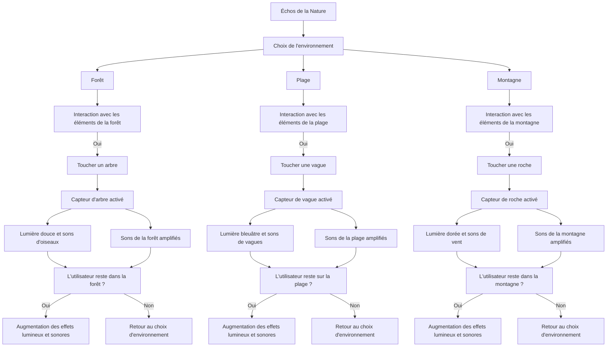

# Échos de la Nature

## Mise en contexte et Objectif
_Échos de la Nature_ est un projet multimédia interactif conçu pour créer une expérience immersive reliant les utilisateurs aux sons de la nature. Face à l'urbanisation croissante, il est crucial de reconnecter les individus à leur environnement et de sensibiliser le public à sa richesse. Ce projet vise à :

- **Sensibilisation à la biodiversité** : Éduquer le public sur l'importance de la protection de la nature.
- **Interactivité** : Offrir une plateforme où les utilisateurs peuvent interagir avec les sons et les paysages, encourageant l'exploration personnelle et la créativité.
- **Bien-être mental** : Promouvoir des expériences apaisantes inspirées par la nature pour réduire le stress.

## Motivation personnelle
En tant qu'amateur de nature et de technologie, je suis motivé par l'idée de combiner ces deux passions pour créer une œuvre qui divertit et éduque. J'espère que ce projet inspirera d'autres personnes à apprécier et à protéger notre environnement.

## Scénario interactif
"Échos de la Nature" est une installation interactive qui invite les utilisateurs à explorer des paysages virtuels représentant divers environnements naturels (forêt, plage, montagne). À travers une interface intuitive, les utilisateurs peuvent :

---

1. **Choisir un environnement** : Sélectionner un paysage parmi plusieurs options.
2. **Interagir avec les éléments** : Cliquer sur des objets (arbres, rochers, vagues) pour déclencher des sons naturels associés.
3. **Composer leur propre ambiance sonore** : Superposer différents sons pour créer une expérience unique et personnalisée.

---
## Interaction utilisateur
### Étapes d'interaction
1. **Interface utilisateur** : L'utilisateur accède à une page d'accueil présentant différents environnements naturels.
2. **Sélection d'un paysage** : L'utilisateur choisit entre une forêt, une plage ou une montagne, chaque choix menant à un environnement 3D interactif.
3. **Interactions sonores** : Chaque élément cliquable dans le paysage déclenche des sons, et les utilisateurs peuvent ajuster le volume et la position des sons.
4. **Création et partage** : À la fin de l'expérience, l'utilisateur peut enregistrer sa composition sonore et la partager sur les réseaux sociaux.
---
## Planche visuelle et sonore
### Références artistiques
1. **Rafael Lozano-Hemmer** : Son œuvre "33 Questions per Minute" illustre l'importance de l'interaction et de l'engagement du public.
2. **Olafur Eliasson** : Ses installations utilisant la lumière et l'eau inspirent une connexion profonde avec la nature.
3. **Bill Fontana** : Artiste sonore connu pour ses œuvres intégrant des sons naturels dans des environnements urbains.

### Esthétique et design
- **Couleurs** : 
  - Vert forêt : #4CAF50
  - Bleu océan : #2196F3
  - Marron terre : #8B4513
  - Jaune soleil : #FFEB3B

---
## Pourquoi j'ai fait ces choix
Les choix esthétiques visent à évoquer des sensations de calme et de connexion à la nature. Les artistes référencés explorent la relation entre l'homme et son environnement, ce qui résonne avec l'objectif du projet.
---
## Support médiatique / Intégration
Le projet sera disponible en ligne via un site web interactif.

# Composantes Physiques Nécessaires
1. **Casques de Réalité Virtuelle (VR)**
   - **Exemples** : Oculus Quest, HTC Vive, ou Valve Index.
   - **Fonction** : Permettre aux utilisateurs d'explorer les environnements naturels en immersion totale.
   
2. **Haut-parleurs Spéciaux**
   - **Type** : Haut-parleurs Bose Surround.
   - **Fonction** : Diffuser des sons naturels de manière immersive.

3. **Écrans de Projection (facultatif)**
   - **Utilisation** : Pour montrer des paysages interactifs aux utilisateurs qui ne portent pas de casque VR.

4. **Contrôleurs de VR**
   - **Fonction** : Permettre aux utilisateurs d'interagir avec l'environnement virtuel.

5. **Ordinateur Puissant**
   - **Configuration** :
     - Processeur : i7 ou plus
     - Carte graphique : NVIDIA RTX 3060 ou équivalent
     - RAM : 32 Go ou plus

6. **Matériel de Capture Audio**
   - **Exemples** : Micros pour enregistrer des sons naturels.

7. **Capteurs de Mouvement (facultatif)**
   - **Exemples** : Caméras de suivi ou capteurs infrarouges.

8. **Dispositifs de Contrôle Tactile**
   - **Exemples** : Gants VR ou manettes.

9. **Supports Physiques (Installation)**
   - **Exemples** : Tablettes ou stations de travail pour l'installation physique.
---
## Considérations Supplémentaires
- **Câblage et Connectivité** : Câbles de haute qualité et adaptateurs nécessaires pour connecter les casques et les haut-parleurs à l'ordinateur.
- **Alimentation Électrique** : Prises suffisantes pour tous les équipements.
- **Espaces de Préparation** : Un espace pour préparer et tester les installations.
---
## Logiciels et techniques utilisées
- **HTML/CSS/JavaScript** : Développement de l'interface web.
- **Web Audio API** : Gestion des sons en temps réel.
- **Three.js** : Création de paysages 3D interactifs.
- **Adobe Audition ou Audacity** : Enregistrement et édition des échantillons sonores.
- **Node.js** (facultatif) : Gestion des enregistrements et partage en ligne.
---
# Développement du projet "Échos de la Nature"

## Développement

## Technologies et Logiciels

Pour réaliser _Échos de la Nature_, plusieurs technologies et logiciels seront nécessaires :

### Technologies
- **WebGL** : Pour le rendu graphique 3D dans le navigateur.
- **Web Audio API** : Pour gérer les sons et effets audio en temps réel.
- **VR SDK** : Kits de développement logiciel spécifiques aux casques VR.

### Logiciels
- **Unity ou Unreal Engine** : Pour le développement d'environnements 3D interactifs.
- **Three.js** : Pour créer des scènes 3D sur le web.
- **Adobe Audition ou Audacity** : Pour l'enregistrement et l'édition des échantillons sonores.
- **Blender ou Maya** : Pour la modélisation et l'animation 3D.
- **HTML/CSS/JavaScript** : Pour le développement de l'interface web.
- **Node.js** (facultatif) : Pour gérer les enregistrements et le partage en ligne.
---
## Branchement et Câbles Nécessaires
Pour assurer le bon fonctionnement du projet, les équipements suivants doivent être correctement branchés :

- **Casque VR** : Connecté via USB ou HDMI à l'ordinateur.
- **Haut-parleurs** : Branchés via des câbles audio (jack 3,5 mm ou RCA).
- **Microphone** : Utilisé pour l'enregistrement des sons naturels.
- **Contrôleur VR** : Connecté via Bluetooth ou câble USB.
- **Câbles d'alimentation** : Assurez-vous que tous les appareils sont alimentés correctement.
---
## Intégration
1. **Développement du site web**
   - **Intégrer Three.js** pour la création des paysages 3D.
   - **Utiliser Web Audio API** pour intégrer les sons interactifs.

2. **Tests**
   - **Tester les performances** sur différents appareils pour assurer une expérience fluide.

3. **Déploiement**
   - **Hébergement** : Choisir une plateforme d’hébergement pour le site web.
   - **Intégration des médias** : Uploader les fichiers audio et visuels.

### Suivi et Maintenance
- **Mises à jour** : Prévoir des mises à jour régulières pour corriger les bugs et améliorer l’expérience en fonction des retours utilisateurs.
