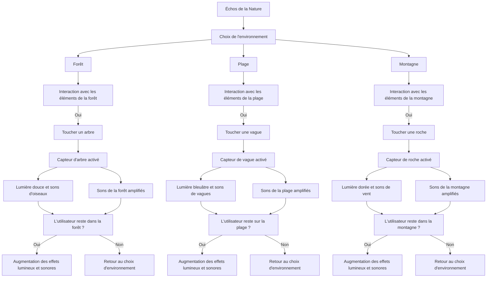
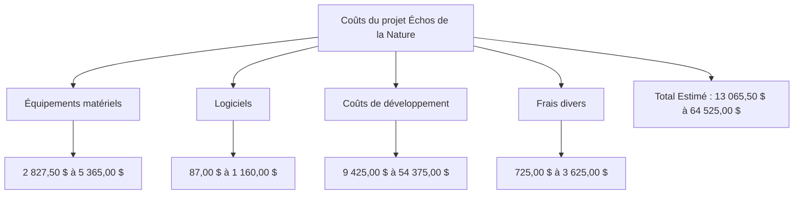

# Échos de la Nature

## Mise en contexte et Objectif

**_Échos de la Nature_** est un projet multimédia interactif conçu pour créer une expérience immersive reliant les utilisateurs aux sons de la nature. Face à l'urbanisation croissante, il est crucial de reconnecter les individus à leur environnement et de sensibiliser le public à sa richesse.

Ce projet vise à :

- **Sensibilisation à la biodiversité :** Éduquer le public sur l'importance de la protection de la nature.
- **Interactivité :** Offrir une plateforme où les utilisateurs peuvent interagir avec les sons et les paysages, encourageant l'exploration personnelle et la créativité.
- **Bien-être mental :** Promouvoir des expériences apaisantes inspirées par la nature pour réduire le stress.

---
## Planche visuelle et sonore
### Références artistiques
1. **Rafael Lozano-Hemmer** : Son œuvre "33 Questions per Minute" illustre l'importance de l'interaction et de l'engagement du public.
2. **Olafur Eliasson** : Ses installations utilisant la lumière et l'eau inspirent une connexion profonde avec la nature.
3. **Bill Fontana** : Artiste sonore connu pour ses œuvres intégrant des sons naturels dans des environnements urbains.

### Esthétique et design
- **Couleurs** : 
  - Vert forêt : #4CAF50
  - Bleu océan : #2196F3
  - Marron terre : #8B4513
  - Jaune soleil : #FFEB3B

  

### Motivation
 En tant qu'amateur de nature et de technologie, je suis motivé par l'idée de combiner ces deux passions pour créer une œuvre qui divertit et éduque. J'espère que ce projet inspirera 
 d'autres personnes à apprécier et à protéger notre environnement. 

  
---

## Pourquoi j'ai fait ces choix
J'ai faite ces choix esthétiques car ils visent à évoquer des sensations de calme et de connexion à la nature. Les artistes référencés explorent la relation entre l'homme et son environnement, ce qui résonne avec l'objectif du projet.

## Interaction utilisateur
### Étapes d'interaction
1. **Interface utilisateur** : L'utilisateur accède à une page d'accueil présentant différents environnements naturels.
2. **Sélection d'un paysage** : L'utilisateur choisit entre une forêt, une plage ou une montagne, chaque choix menant à un environnement 3D interactif.
3. **Interactions sonores** : Chaque élément cliquable dans le paysage déclenche des sons, et les utilisateurs peuvent ajuster le volume et la position des sons.

---
## Schéma interactif

--- 
## Installation interactive physique

## 1. Logiciels Nécessaires

### Développement de l’Expérience VR/3D
- **Unity** ou **Unreal Engine** : Création des mondes 3D interactifs et immersifs.
- **WebGL** (intégré dans Unity/Unreal) : Rendu dans le navigateur pour permettre une accessibilité élargie sans casque VR.

### Création et Gestion de l’Interface Tactile
- **TouchDesigner** : Interface interactive qui gère les interactions et les déclencheurs visuels et sonores.
- **Figma** ou **Adobe XD** (pour le prototypage) : Conception et optimisation de l'interface utilisateur avant intégration dans l'expérience interactive.

### Gestion Sonore
- **Reaper** ou **Ableton Live** : Gestion et synchronisation des effets sonores et ambiances musicales en fonction des interactions, permettant des transitions sonores harmonieuses.

### Automatisation et Contrôle Centralisé
- **Node.js** avec **Socket.io** : Gestion des communications en temps réel entre les capteurs, l'interface tactile et les contrôles de projection.

## 2. Équipements et Matériel

### Écran Tactile Interactif de Grande Taille
- **Écran Tactile Philips 86BDL3550Q/00 (86 pouces)** ou équivalent : Grande taille et technologie tactile capacitive pour une interaction intuitive.

### Système Audio
- **Enceintes Actives avec Entrée XLR** (ex. Yamaha HS8 ou KRK Rokit 8) : Connectées via une carte son externe, contrôlées par Reaper ou Ableton pour ajuster le son en fonction des interactions.
- **Interface Audio** : **Focusrite Scarlett** avec plusieurs entrées/sorties, facilitant le routage sonore.

### Projecteur pour Éclairage Ambiant
- **Projecteur Vidéo** (ex. Epson EB-2255U ou équivalent) : Utilisé pour projeter des couleurs et ambiances lumineuses dans la pièce. La couleur change selon les interactions de l’utilisateur, créant des transitions visuelles immersives.

### Capteur de Son (Déclencheur par Clap)
- **Grove Sound Sensor** ou **Microphone Condensateur avec DSP** (connecté via Arduino ou Raspberry Pi) : Détecte un clap, déclenchant le démarrage de l’expérience.

## 3. Intégration des Capteurs et Logiciels

### Capteur de Clap
- Connecté à un **Arduino** ou **Raspberry Pi**, ce capteur envoie un signal à **Node.js** pour démarrer l’expérience, activant la première scène dans Unity et lançant la première ambiance lumineuse.

### Interaction Tactile et Déclenchement Sonore/Visuel
- **Unity + Projecteur** : Lorsqu’un monde est sélectionné ou qu'un élément est cliqué, Unity envoie un signal au projecteur pour projeter une couleur spécifique dans la pièce, correspondant à l'ambiance sonore et visuelle.
- **TouchDesigner** : Interface tactile réagissant en temps réel aux interactions et déclenchant les sons et lumières projetées.

### Logiciel Centralisé avec Node.js
- **Socket.io** : Assure la communication en temps réel entre les capteurs et les logiciels de contrôle (Unity, Reaper). **Node.js** gère les déclenchements et synchronise les effets visuels et sonores.

## Schéma de Fonctionnement Général

1. **Début** : Clap capté par le capteur -> Signal via Arduino/Raspberry Pi -> **Node.js** -> Unity/VR démarre la scène initiale.
2. **Sélection du Monde** : Interaction tactile sur l'écran -> **Unity** active le monde correspondant -> Unity projette la couleur d’ambiance appropriée via le projecteur et ajuste le son.
3. **Interactions Secondaires** : Clics sur des objets 3D -> Déclenche des effets sonores (Reaper) et change de couleur d'ambiance via le projecteur, synchronisés pour une immersion complète.

---

## 1. Configuration de l'Espace VR

La pièce dédiée à l'expérience VR est conçue pour offrir un environnement immersif minimaliste, où le visiteur peut explorer les différents mondes de **Échos de la Nature** en toute liberté. Elle est donc aménagée avec un minimum d'objets, ne comprenant que :

- **Un écran tactile interactif de grande taille** pour naviguer entre les mondes ou déclencher des effets visuels et sonores.
- **Un casque VR** (ex. Meta Quest, HTC Vive, ou autre compatible avec Unity/Unreal Engine) pour permettre une immersion totale et libre de distractions dans les paysages et ambiances créés.

Cette disposition permet aux utilisateurs de s'immerger pleinement dans l'application, en interagissant avec les éléments visuels et sonores du monde virtuel sans obstacle.

## 2. Détails de l'Expérience VR

L’expérience **Échos de la Nature** se déploie entièrement dans une **application dédiée en réalité virtuelle** développée avec **Unity** (ou **Unreal Engine**), offrant un accès simple et intuitif aux utilisateurs :

- **Sélection des Mondes** : À l’aide de l’écran tactile, les utilisateurs choisissent un monde spécifique pour entrer dans l’environnement correspondant.
- **Immersion Sonore et Visuelle** : Une fois le casque VR en place, l’utilisateur est plongé dans un environnement qui évolue en fonction de ses actions et de l'ambiance sonore. Les sons et lumières sont synchronisés pour correspondre aux éléments cliqués et sélectionnés, renforçant l’expérience immersive.

L'expérience est fluide, conçue pour que les utilisateurs puissent se déplacer librement, explorer chaque monde et interagir sans aucune distraction physique.

---

---
## Support médiatique / Intégration
Code QR qui mène vers le landing page de l'éxpérience. 

## Coûts du projet Échos de la Nature

